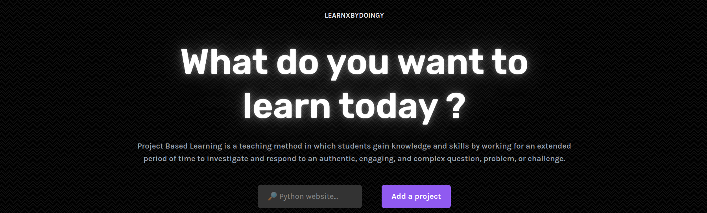

# Learn X by doing Y

## 🛠️ Learn a technology X by doing a project Y

#### [Website](https://aquadzn.github.io/learn-x-by-doing-y)

You can contribute by adding projects to the CSV file. See [CONTRIBUTING.md](CONTRIBUTING.md).

Thanks to
* [tuvtran/project-based-learning](https://github.com/tuvtran/project-based-learning)
* [Xtremilicious/projectlearn-project-based-learning](https://github.com/Xtremilicious/projectlearn-project-based-learning)
* [rby90/Project-Based-Tutorials-in-C](https://github.com/rby90/Project-Based-Tutorials-in-C)
* [danistefanovic/build-your-own-x](https://github.com/danistefanovic/build-your-own-x)
* [AlgoryL/Projects-from-Scratch](https://github.com/AlgoryL/Projects-from-Scratch)
for their data.